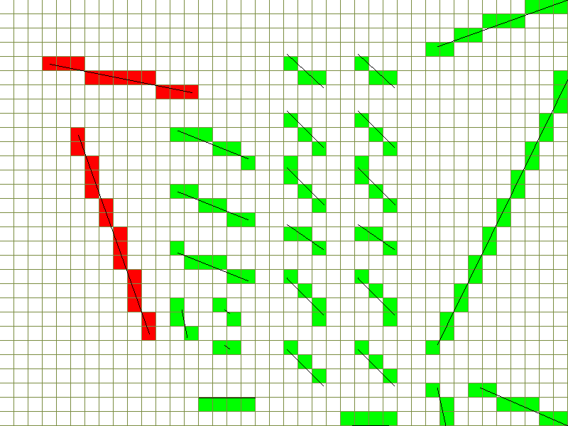

# Rehenz

some code writed by NightHz

包含内容：

- 创建窗口（`window.h`）
  - 创建带帧率的窗口（`window_fc.h`）
- 帧率计数器（`fps_counter.h`）
- 获取输入（`input.h`）
- 噪点生成算法（`noise_gen.h`）
- 打开一个可绘制图像的窗口（`surface_dx8.h`）
- [3D渲染器](#render_soft)（`render_soft.h`）
- [寻路算法](#path_finding)（`path_finding.h`）
- 创建一个网格地图（`tilemap.h`）

## 代码规范

- 文件: `render_soft.h`
- 变量: `int player_speed = 10;`
- 函数: `int GetPlayerSpeed(int number) { ... }`
- 类: `class MovableObj { ... }`
- 枚举: `enum ObjType { Movable = 0, ... }`
- 宏: `#define PI 3.14f`
- 命名空间: `namespace Rehenz { ... }`

## 文件描述

- `clipper.h`: 裁切一个几何元
- `drawer.h`: 绘制/光栅化一个几何元
- `fps_counter.h`: 帧率计数器
- `input.h` : 按键状态检测
- `math.h`: 数学
- `mesh.h`: 存储3D网格
- `noise_gen.h`: 生成一张噪点图，例如 Perlin 噪点
- `path_finding.h`: 寻路算法
- `rehenz.h`: 包含所有的头文件
- `render_soft.h`: 渲染3维世界的软件**渲染器**
- `surface_dx8.h`: 使用 DirectDraw(in DirectX8) 创建一个能够绘制图像的窗口
- `tilemap.h`: 创建一个可渲染的2D网格地图
- `type.h`: 定义基本数据类型，例如 `uint`
- `util.h`: 实用函数
- `window.h`: 快速创建 windows 窗口
- `window_fc.h`: 快速创建带有 fps 显示的 windows 窗口

## 程序设计

### render_soft

**数据**

- `Mesh` 存储顶点与三角片元
- `Object` 存储 `Mesh` 指针与物体变换信息
- `Camera` 存储相机信息与最后一次渲染的图像
- 渲染器使用智能指针来引用数据，这允许用户直接修改物体位置朝向等信息

**管线**

- Copy and transform vertices (vertex shader)
- Clipping and back-face culling
- Mapping to screen
- Traverse all triangles and sampling
- Compute color for all sampling points (pixel shader)
- Use z-buffer merge multiple colors

**光栅化规则**

- 光栅化线时，会绘制两端的点

  
  
  红色为 `class Drawer` 对整数点的光栅化，绿色为 `class DrawerF` 对浮点数点的光栅化

- ~~光栅化三角片元时，会绘制所有的边~~
  - `[-1,1]x[1,-1]` 线性映射到屏幕 `[0,w]x[0,h]` ，然后取整。其中 `(1,-1)` 映射到 `(w,h)` 需要修改为 `(w-1,h-1)`
  - 目前的三角片元光栅化插值有点理不清，但是它能工作
  - `class Drawer` 的三角片元光栅化与 `class DrawerZ` 都没有进行详细分析，过程不明，虽然能工作

**备注**

透视矫正的两种方法

1. 屏幕点按 `t` 线性插值时，顶点会按 `t'` 线性插值，其中 `t' = (w1 * t) / (w1 * t + w2 * (1 - t))`
2. `1/w` 倍的顶点与屏幕点按照相同的 `t` 线性插值

### path_finding

**Dijkstra**

**A\***

h = 欧氏距离

h = 两倍欧氏距离（在此例中效果最好，且路径正确）

令 h 远大于 g

