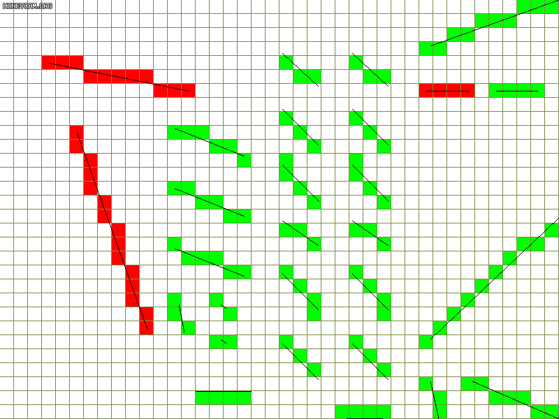

# Rehenz

some code writed by NightHz

包含内容：

- 创建窗口（`window.h`）
  - 创建带帧率的窗口（`window_fc.h`）
- 帧率计数器（`fps_counter.h`）
- 获取输入（`input.h`）
- 噪点生成算法（`noise_gen.h`）
- 打开一个可绘制图像的窗口（`surface_dx8.h`）
- [3D渲染器](#render_soft)（`render_soft.h`）
- [寻路算法](#path_finding)（`path_finding.h`）
- 创建一个网格地图（`tilemap.h`）
- 计算样条线（`spline.h`）

## 代码规范

- 文件: `render_soft.h`
- 变量: `int player_speed = 10;`
- 函数: `int GetPlayerSpeed(int number) { ... }`
- 类: `class MovableObj { ... }`
- 枚举: `enum ObjType { Movable = 0, ... }`
- 宏: `#define PI 3.14f`
- 命名空间: `namespace Rehenz { ... }`

## 文件描述

- `clipper.h`: 裁切一个几何元
- `drawer.h`: 绘制/光栅化一个几何元
- `fps_counter.h`: 帧率计数器
- `hash.h`: 对一些自定义基础类型注入 `std::hash`
- `input.h` : 按键状态检测
- `math.h`: 数学
- `mesh.h`: 存储3D网格
- `noise_gen.h`: 生成一张噪点图，例如 Perlin 噪点
- `path_finding.h`: 寻路算法
- `rehenz.h`: 包含所有的头文件
- `render_soft.h`: 渲染3维世界的软件**渲染器**
- `spline.h`: 计算样条线
- `surface_dx8.h`: 使用 DirectDraw(in DirectX8) 创建一个能够绘制图像的窗口
- `tilemap.h`: 创建一个可渲染的2D网格地图
- `transform.h`: 定义 `Transform` 组件和 `Projection` 组件
- `type.h`: 定义基本数据类型，例如 `uint`
- `util.h`: 实用函数
- `window.h`: 快速创建 windows 窗口
- `window_fc.h`: 快速创建带有 fps 显示的 windows 窗口

## 程序设计

### render_soft

**数据**

- `Mesh` 存储顶点与三角片元
- `Object` 存储 `Mesh` 指针与物体变换信息
- `Camera` 存储相机信息与最后一次渲染的图像
- 渲染器使用智能指针来引用数据，这允许用户直接修改物体位置朝向等信息

**管线**

- Copy and transform vertices (vertex shader)
- Clipping and back-face culling
- Mapping to screen
- Traverse all triangles and sampling
- Compute color for all sampling points (pixel shader)
- Use z-buffer merge multiple colors

**光栅化规则**

对于整数点与浮点数点，设计了两套光栅化规则，整数点对应 `class Drawer` ，浮点数点对应 `class DrawerF` 。

对于整数点，采用**完全覆盖**的设计，线的光栅化会绘制两端的点，三角片元的光栅化会绘制所有的边。下图红色为 `class Drawer` 的光栅化。

|线|三角片元|
|:-:|:-:|
|||
    
对于浮点数点

- 光栅化线时，采样对齐网格中心的点；若两端长度超出半个像素，则会额外对线端点进行采样；上图绿色为 `class DrawerF` 的光栅化
- 光栅化三角片元时
  - 采样被完全包含的网格中心点；若点正好落在边上，则看点的右侧是否被完全包含；若点的右侧也正好落在边上，再看点右侧的下面是否被完全包含
  - 一个等价的严谨数学表达为：采样一个网格中心点 `p` 当且仅当 `∃d2>0,t2>0` 使得对 `∀d∈(0,d2),t∈(0,t2)` 有 `p + d * [cos(t) sin(t)] ∈ Triangle`
  - 实现方法很简单：从上到下扫描三角形，扫上不扫下，再对每条扫描线进行采样，采左不采右
  - 下图为铺满三角形的渲染结果，逆序渲染结果相同

|分布示意图|渲染结果|
|:-:|:-:|
|||

渲染器基于浮点数对顶点光栅化。

**备注**

透视矫正的两种方法

1. 屏幕点按 `t` 线性插值时，顶点会按 `t'` 线性插值，其中 `t' = (w1 * t) / (w1 * t + w2 * (1 - t))`
2. `1/w` 倍的顶点与屏幕点按照相同的 `t` 线性插值

**渲染结果示意图**

|颜色&材质|简单光照|
|:-:|:-:|
|||
|||

### path_finding

**Dijkstra**

**A\***

h = 欧氏距离

h = 两倍欧氏距离（在此例中效果最好，且路径正确）

令 h 远大于 g

